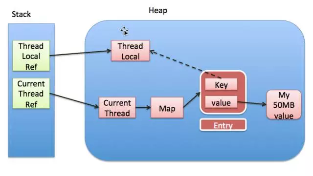

### ThreadLocal 解析
#### 什么是ThreadLocal？
ThreadLocal类顾名思义可以理解为线程本地变量。也就是说如果定义了一个ThreadLocal，每个线程往这个ThreadLocal中读写是线程隔离，互相之间不会影响的。它提供了一种将可变数据通过每个线程有自己的独立副本从而实现线程封闭的机制。

#### 它大致的实现思路是怎样的？
Thread类有一个类型为ThreadLocal.ThreadLocalMap的实例变量threadLocals，也就是说每个线程有一个自己的ThreadLocalMap。

ThreadLocalMap有自己的独立实现，可以简单地将它的key视作ThreadLocal，value为代码中放入的值（实际上key并不是ThreadLocal本身，而是它的一个弱引用）。

每个线程在往某个ThreadLocal里塞值的时候，都会往自己的ThreadLocalMap里存，读也是以某个ThreadLocal作为引用，在自己的map里找对应的key，从而实现了线程隔离。

### 扩展阅读
#### 1. ThreadLocal源码解读
https://www.cnblogs.com/micrari/p/6790229.html

#### 2. 面试题14解析-ThreadLocal原理、应用场景及内存泄漏
[Java面试那些事儿](https://mp.weixin.qq.com/s?__biz=MzIzMzgxOTQ5NA==&mid=2247483704&idx=1&sn=8f4e188f6dbe6684e165da55a476df96&chksm=e8fe9d31df8914277327bc70e791ec385dae98339bbf002d83d9109d5902016ba0535d896530&mpshare=1&scene=1&srcid=1102exZbaLztbBvQVqCBzNeW#rd)
