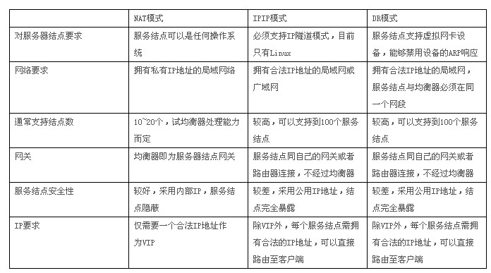

### 一. 负载均衡
#### 1. `DNS`（`Domain Name System`）
`DNS`即域名系统，其作用是将字符串域名解析成相对应的机器`IP`。

可以通过设置，将域名映射到多个服务器的`IP`。客户端使用的是系统的域名，`DNS`采用一种轮询的方式， `客户端1`的机器做域名解析的时候，`DNS`返回`IP1`；`客户端2`的机器做域名解析的时候，`DNS`返回`IP2`，以此实现各个机器的负载相对均衡。

缺陷：由于`DNS`这个分层的系统中有缓存，客户端的机器也有缓存，如果某个机器出故障，域名解析仍然会返回那个出问题机器的`IP`，那所有访问该机器的客户端都会出问题， 即使我们把这个机器的`IP`从`DNS`中删除也不行， 这就麻烦了。

#### 2. `LVS`（`Linux Virtual Server`）
`LVS`是章文嵩博士在1998年5月成立的自由软件项目，现在已经是`Linux`内核的一部分。

`LVS`支持三种负载工作方式：`NAT`方式、`DR`方式和`TUN`方式。

##### 2.1 `NAT`（地址转换）
`NAT`模型其实就是通过网络地址转换来实现负载均衡的。下面是它的流程：

（1）客户端（源地址为`CIP`）请求`Load Balancer`（目标地址为`VIP`）

（2）`Load Balancer`收到客户端的请求，发现源地址为`CIP`，请求的目标地址为`VIP`，那么`Load Balancer`会根据此前设定好的调度算法将客户端请求负载给某台`RS`（实际服务）。`Load Balancer`通过将客户端请求报文中的目标地址，从原来的`VIP`改为`RS`的`IP`，然后再转发给`RS`

（3）`RS`收到客户端的请求，处理好请求后会将一个源地址为自己，目标地址为`CIP`的数据包通过`Load Balancer`发出去

（4）当`Load Balancer`收到一个源地址为`RS`的`IP`，目标地址为`CIP`的数据包，此时`Load Balancer`会将源地址修改为`VIP`，然后再将数据包发送客户端

数据的流向：
```
客户端 --> Load Balancer --> RS --> Load Balancer --> 客户端
```

瓶颈：所有的流量都要通过`Load Balancer`，`Load Balancer`要修改客户端发来的数据包， 还要修改发给客户端的数据包。

##### 2.2 `DR`（直接路由）
`DR`模型在只有请求的时候才会经过`Load Balancer`， 回应的数据包由`RS`直接响应，客户端不需要经过`Load Balancer`。

下面是它的工作流程：

（1）客户端（源地址为`CIP`）请求`Load Balancer`（目标地址为`VIP`）

（2）不管是`Load Balancer`还是`RS`上都需要配置`VIP`，那么当客户端请求到达集群网络的前端路由器的时候，`IP`数据包的源地址为`CIP`，目标地址为`VIP`，此时路由器会发广播问谁是`VIP`。谁先响应路由器那么路由器就会将客户端请求发给谁，这样一来集群系统就没有意义了。可以在网关路由器上配置静态路由指定`VIP`就是`Load Balancer`，或者使用一种机制不让`RS`接收来自网络中的`ARP`地址解析请求，这里只让`Load Balancer`响应这个`VIP`地址的`ARP`请求。这样一来客户端的`IP`数据包都会经过`Load Balancer`。既然`Load Balancer`得到了这个客户端的`IP`数据包，它就可以用某个策略选取一个`RS`，把`IP`数据包原封不动，封装成数据链路层的包（注意，`IP`数据包其实是通过数据链路层发过来的。这里将数据帧中的目标`MAC`地址修改为`RS`的`MAC`地址），直接转发就可以了


（3）当`RS`收到一个源地址为`CIP`目标地址为`VIP`的数据包时，`RS`发现目标地址为`VIP`，而`VIP`就是自己，于是接受数据包并给予处理。当`RS`处理完请求后，会将一个源地址为`VIP`，目标地址为`CIP`的数据包发出去，此时的响应请求就不会再经过`Load Balancer`了，而是直接响应给客户端

数据的流向：
```
客户端 --> Load Balancer --> RS --> 客户端
```

##### 2.3 `TUN`（隧道）
`TUN`的工作机制跟`DR`一样，只不过在转发的时候，它需要重新包装`IP`报文。这里的`RS`离得都比较远。用户请求以后，到`Load Balancer`上的`VIP`上，`Load Balancer`就挑选一个`RS`进行响应，但是`Load Balancer`和`RS`并不在同一个网络上，这时候就用到隧道了。

简单来说`IP`隧道技术就是将 `IP`数据包的上面再封装一层`IP`数据包，然后路由器根据最外层的`IP`地址路由到目的地服务器，目的地服务器拆掉最外层的`IP`数据包，拿到里面的`IP`数据包进行处理。

`Load Balancer`是通过隧道进行了信息传输，虽然增加了负载，可是因为地理位置不同的优势，还是可以参考的一种方案。但是，这种方式需要所有的服务器支持`IP Tunneling`(`IP Encapsulation`)协议。

##### 2.4 `LVS`三种模式对比
`IPIP` 模式即 `TUN` 模式。



#### 3. `Nginx`
`Nginx` 是 `lgor Sysoev` 为俄罗斯访问量第二的 `rambler.ru` 站点设计开发的。从 `2004` 年发布至今，凭借开源的力量，已经接近成熟与完善。

`Nginx` 功能丰富，可作为 `HTTP`服务器，也可作为反向代理服务器，邮件服务器。支持`FastCGI`、`SSL`、`Virtual Host`、`URL Rewrite`、`Gzip`等功能。并且支持很多第三方的模块扩展。

`Nginx`提供的负载均衡策略有`2`种：内置策略和扩展策略。内置策略为轮询，加权轮询，`Ip hash`。扩展策略，即自定义实现负载均衡算法。

Nginx的缺点是：

+ 1、`Nginx`仅能支持`http`、`https`和`Email`协议，这样就在适用范围上面小些，这个是它的缺点

+ 2、对后端服务器的健康检查，只支持通过端口来检测，不支持通过`url`来检测。不支持`Session`的直接保持，但能通过`ip_hash`来解决

#### 4. `HAProxy`
`HAProxy` 提供高可用性、负载均衡以及基于 `TCP` 和 `HTTP` 应用的代理，支持虚拟主机，它是免费、快速并且可靠的一种解决方案。根据官方数据，其最高极限支持 `10G` 的并发。`HAProxy` 支持从 `4` 层至 `7` 层的网络交换，即覆盖所有的 `TCP` 协议。就是说，`HaProxy` 甚至还支持 `MySQL` 的均衡负载。

` HAProxy`的特点是：
+ 1、`HAProxy` 是支持虚拟主机的，并能支持上万级别的连接;

+ 2、能够补充 `Nginx` 的一些缺点比如 `Session` 的保持，`cookie`的引导等工作;

+ 3、支持 `url` 检测后端的服务器出问题的检测会有很好的帮助;

+ 4、它跟 `LVS` 一样，本身仅仅就只是一款负载均衡软件；单纯从效率上来讲 `HAProxy` 更会比Nginx有更出色的负载均衡速度，在并发处理上也是优于 `Nginx` 的;

+ 5、`HAProxy`可以对 `MySQL` 读进行负载均衡，对后端的 `MySQL` 节点进行检测和负载均衡，不过在后端的 `MySQL slaves` 数量超过 `10` 台时性能不如 `LVS`，所以我向大家推荐 `LVS+Keepalived`;

+ 6、能够提供 `4` 层，`7` 层代理。`HAProxy` 支持两种主要的代理模式：`TCP`也即 `4` 层（大多用于邮件服务器、内部协议通信服务器等），和 `7` 层（`HTTP`）。在`4` 层模式下， `HAProxy` 仅在客户端和服务器之间转发双向流量。`7` 层模式下，`HAProxy`会分析协议，并且能通过允许、拒绝、交换、增加、修改或者删除请求 (`request`)或者回应(`response`)里指定内容来控制协议，这种操作要基于特定规则。

`HAProxy` 用作负载均衡，本身是一个反向代理，可视为路由。

`HAProxy` 有超时失效转移，但是不会剔除失效节点，需要人工介入！

#### 5. ``F5``负载均衡器
`F5`负载均衡器是应用交付网络的全球领导者 `F5 Networks` 公司提供的一个负载均衡器专用设备，`F5 BIG-IP LTM` 的官方名称叫做本地流量管理器，可以做4-7层负载均衡，具有负载均衡、应用交换、会话交换、状态监控、智能网络地址转换、通用持续性、响应错误处理、`IPv6`网关、高级路由、智能端口镜像、`SSL`加速、智能`HTTP`压缩、`TCP`优化、第7层速率整形、内容缓冲、内容转换、连接加速、高速缓存、`Cookie`加密、选择性内容加密、应用攻击过滤、拒绝服务(`DoS`)攻击和`SYN Flood`保护、防火墙—包过滤、包消毒等功能。

以下是`F5 BIG-IP`用作`HTTP`负载均衡器的主要功能：

（1）`F5 BIG-IP`提供12种灵活的算法将所有流量均衡的分配到各个服务器，而面对用户，只是一台虚拟服务器。

（2）`F5 BIG-IP`可以确认应用程序能否对请求返回对应的数据。假如`F5 BIG-IP`后面的某一台服务器发生服务停止、死机等故障，`F5`会检查出来并将该服务器标识为宕机，从而不将用户的访问请求传送到该台发生故障的服务器上。这样，只要其它的服务器正常，用户的访问就不会受到影响。宕机一旦修复，`F5 BIG-IP`就会自动查证应用已能对客户请求作出正确响应并恢复向该服务器传送。

（3）`F5 BIG-IP`具有动态`Session`的会话保持功能。

（4）`F5 BIG-IP`的`iRules`功能可以做`HTTP`内容过滤，根据不同的域名、`URL`，将访问请求传送到不同的服务器。

#### 6. `HTTP`重定向
当用户发来请求的时候，`Web`服务器通过修改`HTTP`响应头中的`Location`标记来返回一个新的`url`，然后浏览器再继续请求这个新`url`，实际上就是页面重定向。通过重定向，来达到负载均衡的目标。重定向的`HTTP`返回码是`302`。

优点：比较简单。

缺点：浏览器需要两次请求服务器才能完成一次访问，性能较差，重定向服务自身的处理能力有可能成为瓶颈。

#### 7. 负载均衡算法
负载均衡算法有很多，归结起来，不外乎以下3种：

+ 轮询 `Round Robin`

+ 随机 `Random`

+ 散列 `Hash`

### 二. 高可用
#### 1. `keepalived`
`keepalived` 是 `VRRP`（`Virtual Router Redundancy Protocol`，虚拟路由器冗余协议）的实现。`Keepalived` 的作用是检测服务器的状态，如果有一台`web`服务器宕机，或工作出现故障，`Keepalived`将检测到，并将有故障的服务器从系统中剔除，同时使用其他服务器代替该服务器的工作，当服务器工作正常后`Keepalived`自动将服务器加入到服务器群中，这些工作全部自动完成，不需要人工干涉，需要人工做的只是修复故障的服务器。

`keepalived` 高可用保证，提供一个虚拟地址，可视为`DNS`。

`keepalived` 有失效剔除，但没有负载均衡。

#### 2. 集群模式
集群模式一般具有以下`3`个特点:

+ 负载均衡

+ 预防单点故障（高可用）

+ 动态扩展

意味着，集群中即使有部分节点故障，也不会影响可用性。

### 扩展阅读
#### 1. 负载均衡的原理
微信公众号 [码农翻身](https://mp.weixin.qq.com/s?__biz=MzAxOTc0NzExNg==&mid=2665514539&idx=1&sn=e36b47d93396844bb1a46c82c9b65df7&chksm=80d67e68b7a1f77e80052ea57e4676ea79c5c53b49a038f597ee99dba54ad15d2abdfe36433c&mpshare=1&scene=1&srcid=08140yFzvlCA8KMMUIW3gtTH#rd)

#### 2. LVS三种模式配置及优点缺点比较
https://www.cnblogs.com/lixigang/p/5371816.html

#### 3. RabbitMQ3.6.3集群搭建+HAProxy1.6做负载均衡
https://www.cnblogs.com/lion.net/p/5725474.html

#### 4. Nginx配置详解
https://www.cnblogs.com/knowledgesea/p/5175711.html

#### 5. （总结）Nginx/LVS/HAProxy负载均衡软件的优缺点详解
http://www.ha97.com/5646.html

#### 6. Nginx配置文件详细说明
http://www.cnblogs.com/xiaogangqq123/archive/2011/03/02/1969006.html
