# Nacos 原理&实战

### 1. Dynamic Naming and Configuration Service


虽然我们经常说 Nacos，但 Nacos 到底是啥意思呢？

我给大家翻译翻译，什么叫 Nacos：Dynamic Naming and Configuration Service。

哦，原来是『动态命名和配置服务』。

从名字上看，Nacos 应该是注册中心和配置中心的混合体。

实际上其核心定位是 “一个更易于帮助构建云原生应用的动态服务发现、配置和服务管理平台”。

今天我们只讲 Nacos 注册中心的功能。

### 2. 注册中心

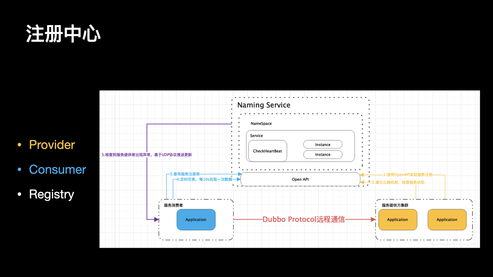

注册中心的功能体现在：

（1）服务注册：服务实例启动时注册到服务注册表，关闭时则注销

（2）服务发现：服务消费者可以通过查询服务注册表来获得可用的实例

（3）健康检查：服务注册中心需要验证服务实例是否可以正确的处理请求

在使用注册中心时，一共有三种角色：服务提供者（Service Provider）、服务消费者（Service Consumer）、注册中心（Registry）。

在一些文章中，服务提供者被称为 Server，服务消费者被称为 Client。

#### 2.1 Provider

启动时，向 Registry 注册自己为一个服务（Service）的实例（Instance）。

同时，定期向 Registry 发送心跳，告诉自己还存活。

关闭时，向 Registry 取消注册。

#### 2.2 Consumer

启动时，向 Registry 订阅使用到的服务，并缓存服务的实例列表在内存中。

后续，Consumer 向对应服务的 Provider 发起调用时，从内存中的该服务的实例列表选择一个，进行远程调用。

关闭时，向 Registry 取消订阅。

#### 2.3 Registry

Provider 超过一定时间未心跳时，从服务的实例列表移除。

服务的实例列表发生变化（新增或者移除）时，通知订阅该服务的 Consumer，从而让 Consumer 能够刷新本地缓存。

当然，不同的注册中心可能在实现原理上会略有差异。例如说，Eureka 注册中心，并不提供通知功能，而是 Eureka Client 自己定期轮询，实现本地缓存的更新。

另外，Provider 和 Consumer 是角色上的定义，一个服务同时即可以是 Provider 也可以作为 Consumer。

### 3. 目录


如果大家对 Nacos 的配置中心感兴趣兴趣，可以参见后文的参考资料。

更进一步的，可以看 Apollo 的官方文档，Nacos 的配置功能与此大同小异。

接下来我们将从以下 4 个方面，看下 Nacos 作为注册中心，有哪些功能特点。

（1）数据模型&部署架构

（2）一致性协议：AP 还是 CP

（3）如何做到高可用

（4）实战：最佳实践

### 4. 数据模型

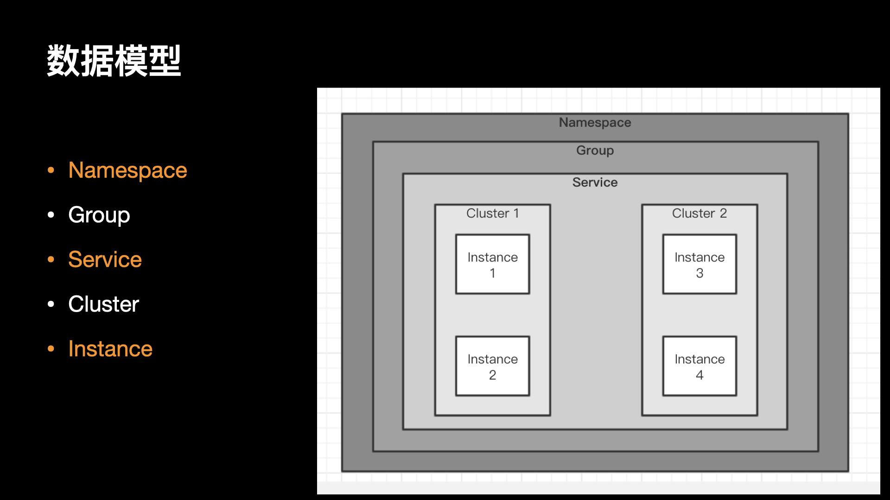

#### 4.1 Namespace 和 Group

namespace 可以解决多环境以及多租户数据的隔离问题。比如在多套环境下，可以根据指定环境创建不同的 namespace，实现多环境隔离。或者在多租户的场景中，每个用户可以维护自己的 namespace，实现每个用户的配置数据和注册数据的隔离。

group 是分组机制，它的纬度是实现服务注册信息或者 DataId 的分组管理机制，对于 group 的用法，没有固定的规则，它也可以实现不同环境下的分组，也可以实现同一个应用下不同配置类型或者不同业务类型的分组。

官方建议是，namespace 用来区分不同环境，group 可以专注在业务层面的数据分组。实际上在使用过程中，最重要的是提前定要统一的口径和规定，避免不同的项目团队混用导致后期维护混乱的问题。

#### 4.2 Service Cluster Instance

注册中心的核心数据是服务的名字和它对应的网络地址，当服务注册了多个实例时，我们需要对不健康的实例进行过滤或者针对实例的一些特征进行流量的分配，那么就需要在实例上存储一些例如健康状态、权重等属性。

随着服务规模的扩大，渐渐的又需要在整个服务级别设定一些权限规则、以及对所有实例都生效的一些开关，于是在服务级别又会设立一些属性。

再往后，我们又发现单个服务的实例又会有划分为多个子集的需求，例如一个服务是多机房部署的，那么可能需要对每个机房的实例做不同的配置，这样又需要在服务和实例之间再设定一个数据级别。

Nacos 的数据模型虽然相对复杂，但是它并不强制你使用它里面的所有数据，在大多数场景下，你可以选择忽略这些数据。

#### 4.3 元数据

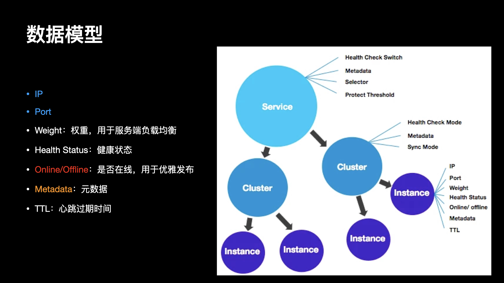

- 提供一个或多个服务的具有可访问网络地址（IP:Port）的进程；

- Weight，权重，服务端负载均衡的一个参数；

- Health Status，健康状态；

- Online/Offline，是否在线，用于优雅发布；

- Nacos 元数据（如配置和服务）描述信息，如服务版本、权重、容灾策略、负载均衡策略、鉴权配置、各种自定义标签 (label)，从作用范围来看，分为服务级别的元信息、集群的元信息及实例的元信息；

- TTL，心跳的过期时间，默认 5s 一次心跳，15 秒过期；

### 5. 部署架构

#### 5.1 1.X

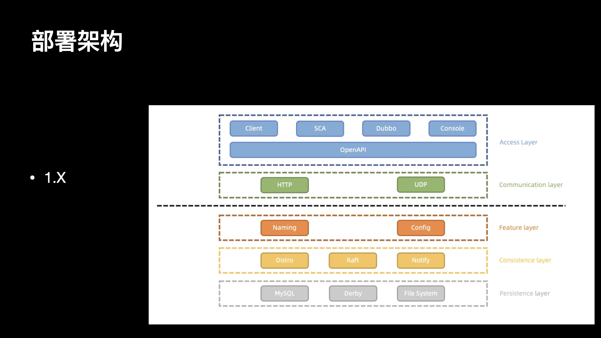

Nacos 1.X 大致分为 5 层， 分别是接入、通信、功能、同步和持久化。

接入层是用户最直接交互的层面，主要有 Nacos 客户端，以及依赖客户端的 Dubbo 和 SCA 以及用户操作的控制台 Console 组成。 客户端和 Console 进行服务和配置操作，统一通过 HTTP 的 OpenAPI 发起通信请求。

通信层主要基于 HTTP 的短连接请求模型进行，部分推送功能通过 UDP 进行通信。

功能目前有服务发现和配置管理，这层也就是实际管理服务和配置的业务层。

同步层有数据同步的 AP 模式 Distro 和 CP 模式 Raft，还有有一个最简易的水平通知 Notify，用处各不相同：

- Distro：非持久化服务的同步模式

- Raft：持久化服务的同步模式、以及使用 Derby 作为配置的存储时同步配置操作。

- Notify：使用 MySQL 作为配置的存储时，通知其他节点更新缓存及发起配置推送。

持久化层 Nacos 使用 MySQL、Derby 和本地文件系统来进行数据的持久化 配置信息，用户信息，权限信息存储在 MySQL 或 Derby 数据库中， 持久化服务信息及服务和实例元数据信息存储在本地文件系统。

1.X 架构存在的问题：一句话总结，心跳多，无效查询多，心跳续约感知变化慢，连接消耗大，资源空耗严重。

（1）心跳数量多，导致 TPS 居高不下

通过心跳续约，当服务规模上升时，特别是类似 Dubbo 的接口级服务较多时，心跳及配置元数据的轮询数量众多，导致集群 TPS 很高，系统资源高度空耗。

（2）通过心跳续约感知服务变化，时延长

心跳续约需要达到超时时间才会移除并通知订阅者，默认为 15s，时延较长，时效性差。若改短超时时间，当网络抖动时，会频繁触发变更推送，对客户端服务端都有更大损耗。

（3）UDP 推送不可靠，导致 QPS 居高不下

由于 UDP 不可靠，因此客户端侧需要每隔一段时间进行对账查询，保证客户端缓存的服务列表的状态正确，当订阅客户端规模上升时，集群 QPS 很高，但大多数服务列表其实不会频繁改变，造成无效查询，从而存在资源空耗。

（4）基于 HTTP 短连接模型，TIME_WAIT 状态连接过多

HTTP 短连接模型，每次客户端请求都会创建和销毁 TCP 链接，TCP 协议销毁的链接状态是 WAIT_TIME，完全释放还需要一定时间，当 TPS 和 QPS 较高时，服务端和客户端可能有大量的 WAIT_TIME 状态链接，从而会导致 connect time out 错误或者 Cannot assign requested address 的问题。

（5）配置模块的 30 秒长轮询 引起的频繁 GC

配置模块使用 HTTP 短连接阻塞模型来模拟长连接通信，但是由于并非真实的长连接模型，因此每 30 秒需要进行一次请求和数据的上下文切换，每一次切换都有引起造成一次内存浪费，从而导致服务端频繁 GC。

#### 5.2 2.X

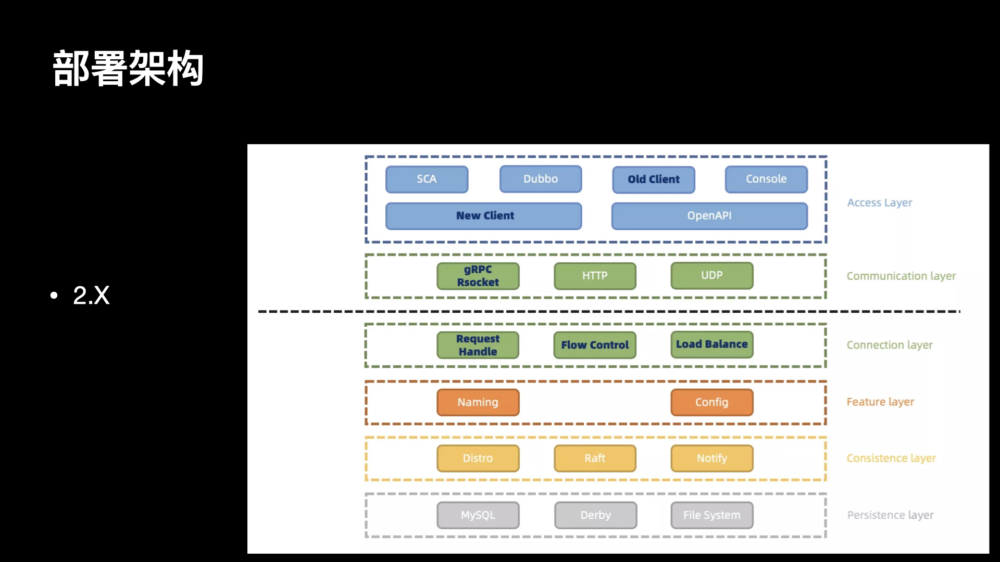

全新 2.0 架构不仅将性能大幅提升 10 倍，而且内核进行了分层抽象，并且实现插件扩展机制。

Nacos 2.X 在 1.X 的架构基础上 新增了对长连接模型的支持，同时保留对旧客户端和 openAPI 的核心功能支持

通信层目前通过 gRPC 和 Rsocket 实现了长连接 RPC 调用和推送能力。

在服务端侧，新增一个链接层，用来将不同类型的 Request 请求，将来自不同客户端的不同类型请求，转化为相同语意的功能数据结构，复用业务处理逻辑。同时，将来的流量控制和负载均衡等功能也会在链接层处理。

其他架构分层在大体上保持不变。

- 优点

（1）客户端不再需要定时发送实例心跳，只需要有一个维持连接可用 keepalive 消息即可。重复 TPS 可以大幅降低。

（2）TCP 连接断开可以被快速感知到，提升反应速度。

（3）长连接的流式推送，比 UDP 更加可靠；nio 的机制具有更高的吞吐量，而且由于可靠推送，可以加长客户端用于对账服务列表的时间，甚至删除相关的请求。重复的无效 QPS 可以大幅降低。

（4）长连接避免频繁连接开销，可以大幅缓解 TIME\_ WAIT 问题。

（5）真实的长连接，解决配置模块 GC 问题。

（6）更细粒度的同步内容，减少服务节点间的通信压力。

- 缺点

没有银弹的方案，新架构也会引入一些新问题

（1）内部结构复杂度上升，管理连接状态，连接的负载均衡需要管理。

（2）数据由原来的无状态，变为与连接绑定的有状态数据，流程链路更长。

（3）RPC 协议的观测性不如 HTTP。即使 gRPC 基于 HTTP2.0Stream 实现，仍然不如直接使用 HTTP 协议来的直观。

### 6. 一致性协议

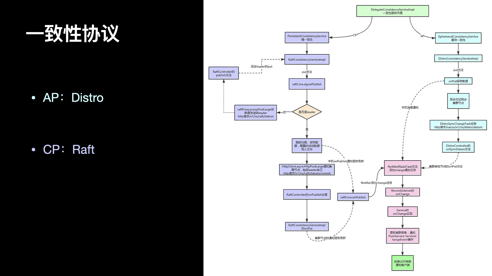

这两种数据一致性协议有各自的使用场景，对服务注册的需求不同，就会导致使用不同的协议。Nacos 因为要支持多种服务类型的注册，并能够具有机房容灾、集群扩展等必不可少的能力，在 1.0.0 正式支持 AP 和 CP 两种一致性协议并存。

有的文章介绍 Nacos 的一致性模型是 AP + CP，这么说很容易让人误解，其实 Nacos 并不是同时支持两种一致性模型，也不是支持两种模型的切换，而是支持 AP 或 CP，只能二选一。介绍一致性模型之前，需要先了解到 Nacos 中的两个概念：临时服务和持久化服务。

- 临时服务（Ephemeral）：临时服务健康检查失败后会从列表中删除，常用于服务注册发现场景。

- 持久化服务（Persistent）：持久化服务健康检查失败后会被标记成不健康，常用于 DNS 场景。

临时服务使用的是 Nacos 为服务注册发现场景定制化的私有协议 distro，其一致性模型是 AP；而持久化服务使用的是 raft 协议，其一致性模型是 CP。所以以后不要再说 Nacos 是 AP + CP 了，更建议加上服务节点状态或者使用场景的约束。

#### 6.1 注册逻辑

服务端收到请求后，会先在 Contoller 中进行数据的读取和校验，比如 IP 是否合法，服务名是否正确等等。校验通过后，如果这个服务是第一次注册，Nacos 会在服务端生成一个 Service 对象，然后把这次注册的实例信息存入这个 Service 对象中；如果 Nacos 服务端已经有了这个 Service 对象，那么就会直接把新注册的实例信息存入对象。这个 Service 对象通过 命名空间+Group+Service 的组合来保证唯一性。

完成实例存入 Service 的同时，会触发两个事件，其中一个事件是用于数据同步的，Nacos 服务端会根据这个服务是否是临时对象的信息，使用 Distro 或者 Raft 协议进行同步，通知其他的 Nacos 节点该服务发生了变更；另一个事件则通知在该 Nacos 服务节点上订阅了该服务的订阅者，并根据订阅者信息，通过 UDP 的方式，把最新的服务列表推送到订阅者客户端上。这就完成了一次服务注册流程。

另外，对于那些被定义为持久化的服务的所有信息，都会通过 raft 协议，保证能够写入到文件系统中被持久化。

最后，其他的 Nacos 节点，在通过同步而进行 Service 变更的时候也会触发通知订阅者的事件，从而使在其他 Nacos 服务节点上订阅该服务的订阅者也能收到推送。

#### 6.2 AP:Distro

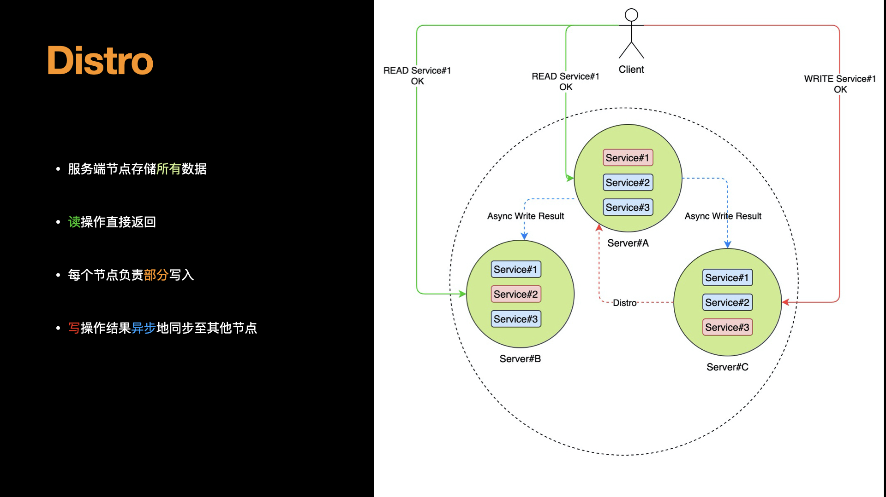

Distro 是阿里巴巴的私有协议，开源的 Nacos 就是使用的这个协议，这个协议有以下几个关键点：

（1）distro 协议是为了注册中心而创造出的协议；

（2）客户端与服务端有两个重要的交互，服务注册与心跳发送；

（3）客户端以服务为维度向服务端注册，注册后每隔一段时间向服务端发送一次心跳，心跳需要带上注册服务的全部信息，在客户端看来，服务端节点对等，所以请求的节点是随机的；

（4）客户端请求失败则换一个节点重新发送请求；

（5）服务端节点都存储所有数据，但每个节点只负责其中一部分服务，在接收到客户端的“写”（注册、心跳、下线等）请求后，服务端节点判断请求的服务是否为自己负责，如果是，则处理，否则交由负责的节点处理；

（6）每个服务端节点主动发送健康检查到其他节点，响应的节点被该节点视为健康节点；

（7）服务端在接收到客户端的服务心跳后，如果该服务不存在，则将该心跳请求当作注册请求来处理；

（8）服务端如果长时间未收到客户端心跳，则下线该服务；

（9）负责的节点在接收到服务注册、服务心跳等写请求后将数据写入后即返回，后台异步地将数据同步给其他节点；

（10）节点在收到读请求后直接从本机获取后返回，无论数据是否为最新。

distro 协议的工作流程如下：

（1）Nacos 启动时首先从其他远程节点同步全部数据。

（2）Nacos 每个节点是平等的都可以处理写入请求，同时把新数据同步到其他节点。

（3）每个节点只负责部分数据，定时发送自己负责数据的校验值到其他节点来保持数据一致性。

（4）每个节点负责一部分服务的写入，但每个节点都可以接收到写入请求，这时就存在两种情况：

- 当该节点接收到属于该节点负责的服务时，直接写入。
- 当该节点接收到不属于该节点负责的服务时，将在集群内部路由，转发给对应的节点，从而完成写入。

（5）读取操作则不需要路由，因为集群中的各个节点会同步服务状态，每个节点都会有一份最新的服务数据。

（6）而当节点发生宕机后，原本该节点负责的一部分服务的写入任务会转移到其他节点，从而保证 Nacos 集群整体的可用性。

#### 6.3 与 Eureka 的对比

Distro 协议看起来很像 Eureka 的广播模式，也有点像 Gossip 协议，但其实是有很大区别的。

Eureka Server 的同步遵循着一个非常简单的原则：只要有一条边将节点连接，就可以进行信息传播与同步。可以采用两两注册的方式实现集群中节点完全对等的效果，实现最高可用性集群，任何一台注册中心故障都不会影响服务的注册与发现。

Eureka-Server 内嵌 Eureka-Client，用于和 Eureka-Server 集群里其他节点通信交互。

Eureka-Server 多节点注册信息， P2P 同步。

一个 Eureka-Server 收到 Eureka-Client 注册（Register，还有 Renew，Cancel）请求后(replication=false)，Eureka-Server 会自己模拟 Eureka-Client 发送注册请求(replication=true，从而避免重复的 replicate)到其它的 Eureka-Server。

也就是说，Eureka-Server 之间的信息同步是推模式！

通过这种方式，Service Provider 只需要通知到任意一个 Eureka Server 后就能保证状态会在所有的 Eureka Server 中得到更新（前提是这些 Eureka Server 之间的最短路径为 1，即两两互联）。

记住：Eureka 通过 Heartbeat 实现 Eureka-Server 集群同步的最终一致性。

Eureka 的这种广播模式，如果全部两两互联，假设集群共 N 个节点，共 M 个心跳，则会有 NxM 个消息。

而对于 Nacos 来说，最多也就 2xM 个消息（在所有消息都需要转发的情况下）。

总结：Nacos 每个节点保留了所有数据，可以处理读请求，而写请求需要转发，最多转发一次。

#### 6.4 CP:Raft

Nacos 集群采用 Raft 算法实现。它是一种比较简单的选举算法，用于选举出 Nacos 集群中最重要的 Leader（领导）节点。

在集群中选举出 Leader 是最重要的工作，产生选举的时机有三个：

- 在 Nacos 节点启动后，还没有产生 Leader 时选举；

- 集群成员总量变更时重新选举；

- 当 Leader 停止服务后重新选举；

在 Raft 算法中，只有 Leader 才拥有数据处理与信息分发的权利。因此当微服务启动时，假如注册中心指定为 Follower 节点，则步骤如下：

第一步，Follower 会自动将注册心跳包转给 Leader 节点；

第二步，Leader 节点完成实质的注册登记工作；

第三步，完成注册后向其他 Follower 节点发起“同步注册日志”的指令；

第四步，所有可用的 Follower 在收到指令后进行“ack 应答”，通知 Leader 消息已收到；

第五步，当 Leader 接收过半数 Follower 节点的 “ack 应答”后，返回给微服务“注册成功”的响应信息。

此外，对于其他无效的 Follower 节点，Leader 仍会不断重新发送，直到所有 Follower 的状态与 Leader 保持同步。

### 7. 高可用


当我们在聊高可用时，我们在聊什么？

系统可用性达到 99.99%
在分布式系统中，部分节点宕机，依旧不影响系统整体运行
服务端集群化部署多个节点

这些都可以认为是高可用，而我今天介绍的 Nacos 高可用，则是 Nacos 为了提升系统稳定性而采取的一系列手段。Nacos 的高可用不仅仅存在于服务端，同时也存在于客户端，以及一些与可用性相关的功能特性中，这些点组装起来，共同构成了 Nacos 的高可用。

（1）重试

当其中一台机器宕机时，为了不影响整体运行，客户端会存在重试机制。

逻辑非常简单，拿到地址列表，在请求成功之前逐个尝试，直到成功为止。

该可用性保证存在于 nacos-client 端。

（2）本地缓存

本地缓存文件 Failover 机制

注册中心发生故障最坏的一个情况是整个 Server 端宕机，这时候 Nacos 依旧有高可用机制做兜底。

Nacos 存在本地文件缓存机制，nacos-client 在接收到 nacos-server 的服务推送之后，会在内存中保存一份，随后会落盘存储一份快照。snapshot 默认的存储路径为：{USER_HOME}/nacos/naming/ 中：

这份文件有两种价值，一是用来排查服务端是否正常推送了服务；二是当客户端加载服务时，如果无法从服务端拉取到数据，会默认从本地文件中加载。

前提是构建 NacosNaming 时传入了该参数：namingLoadCacheAtStart=true

在生产环境，推荐开启该参数，以避免注册中心宕机后，导致服务不可用，在服务注册发现场景，可用性和一致性 trade off 时，我们大多数时候会优先考虑可用性。

细心的读者还注意到{USER_HOME}/nacos/naming/{namespace} 下除了缓存文件之外还有一个 failover 文件夹，里面存放着和 snapshot 一致的文件夹。这是 Nacos 的另一个 failover 机制，snapshot 是按照某个历史时刻的服务快照恢复恢复，而 failover 中的服务可以人为修改，以应对一些极端场景。

该可用性保证存在于 nacos-client 端。

（3）心跳同步服务

心跳机制一般广泛存在于分布式通信领域，用于确认存活状态。一般心跳请求和普通请求的设计是有差异的，心跳请求一般被设计的足够精简，这样在定时探测时可以尽可能避免性能下降。而在 Nacos 中，出于可用性的考虑，一个心跳报文包含了全部的服务信息，这样相比仅仅发送探测信息降低了吞吐量，而提升了可用性，怎么理解呢？考虑以下的两种场景：

- nacos-server 节点全部宕机，服务数据全部丢失。nacos-server 即使恢复运作，也无法恢复出服务，而心跳包含全部内容可以在心跳期间就恢复出服务，保证可用性。

- nacos-server 出现网络分区。由于心跳可以创建服务，从而在极端网络故障下，依旧保证基础的可用性。

### 8. 健康检查

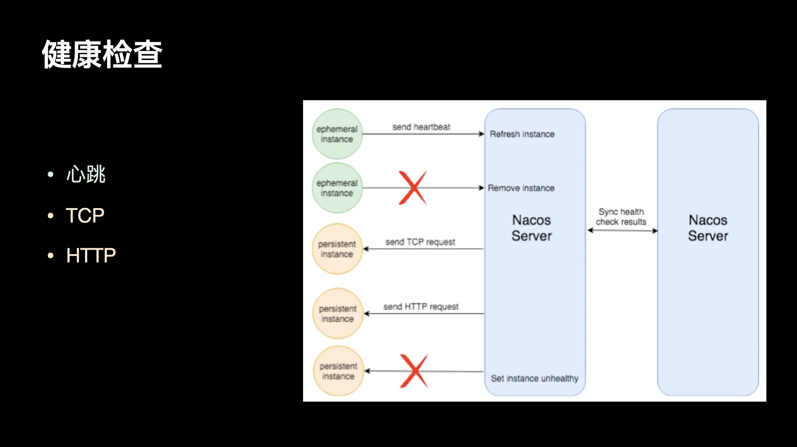

Nacos 既支持客户端的健康检查，也支持服务端的健康检查，同一个服务可以切换健康检查模式。

在定义上区分临时实例和持久化实例的关键是健康检查的方式。临时实例使用客户端上报模式，而持久化实例使用服务端反向探测模式。

临时实例需要能够自动摘除不健康实例，而且无需持久化存储实例，那么这种实例就适用于类 Gossip 的协议。

右边的持久化实例使用服务端探测的健康检查方式，因为客户端不会上报心跳，那么自然就不能去自动摘除下线的实例。

#### 8.1 心跳：TTL

Zookeeper 和 Eureka 都实现了一种 TTL 的机制，就是如果客户端在一定时间内没有向注册中心发送心跳，则会将这个客户端摘除。Eureka 做的更好的一点在于它允许在注册服务的时候，自定义检查自身状态的健康检查方法。这在服务实例能够保持心跳上报的场景下，是一种比较好的体验，在 Dubbo 和 SpringCloud 这两大体系内，也被培养成用户心智上的默认行为。

Nacos 也支持这种 TTL 机制，不过这与 ConfigServer 在阿里巴巴内部的机制又有一些区别。Nacos 目前支持临时实例使用心跳上报方式维持活性，发送心跳的周期默认是 5 秒，Nacos 服务端会在 15 秒没收到心跳后将实例设置为不健康，在 30 秒没收到心跳时将这个临时实例摘除。

#### 8.2 TCP HTTP

有一些服务无法上报心跳，但是可以提供一个检测接口，由外部去探测。这样的服务也是广泛存在的，而且以我们的经验，这些服务对服务发现和负载均衡的需求同样强烈。

服务端健康检查最常见的方式是 TCP 端口探测和 HTTP 接口返回码探测，这两种探测方式因为其协议的通用性可以支持绝大多数的健康检查场景。

在其他一些特殊的场景中，可能还需要执行特殊的接口才能判断服务是否可用。例如部署了数据库的主备，数据库的主备可能会在某些情况下切换，需要通过服务名对外提供访问，保证当前访问的库是主库。此时的健康检查接口，可能就是一个检查数据库是否是主库的 MYSQL 命令了。

### 9. 实战：最佳实践


### 10 实战：升级


### 11. 固有问题：服务感知

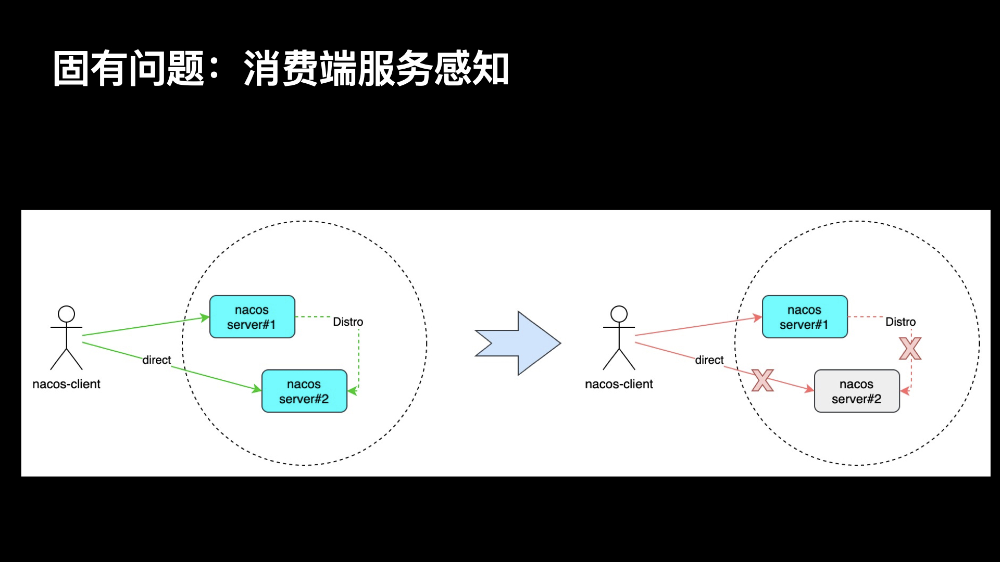

服务端某节点停止，已不能对外提供服务;

其他服务端节点未将该节点从可用列表中剔除（最长持续一个心跳周期）;

期间客户端请求该节点失败，重试其他节点也转发失败，最终获得实例为空。

### 12. 协议问题：ABA 问题

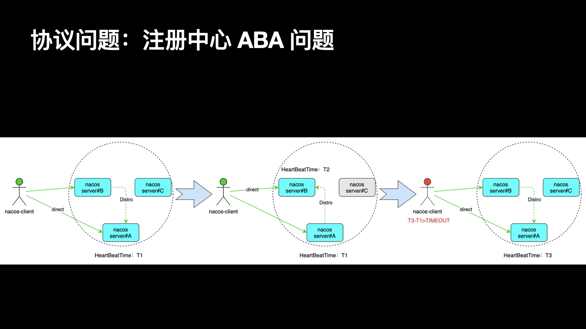

集群中有  3  个节点  ABC，实例  X  对应的处理服务端为  A；

当服务端  C  停止之后，实例 X  对应的处理服务端变为  B；

在  AB  集群稳定之后，再重启服务端  C；

当  ABC  集群稳定之后，实例  X  对应的处理服务端又变为  A；

此时 A 会检查 X 的心跳时间，发现已经超时，下线 X，并同步集群！
直到  X  继续上传心跳，X  才恢复。

### 13. 版本问题：心跳数据

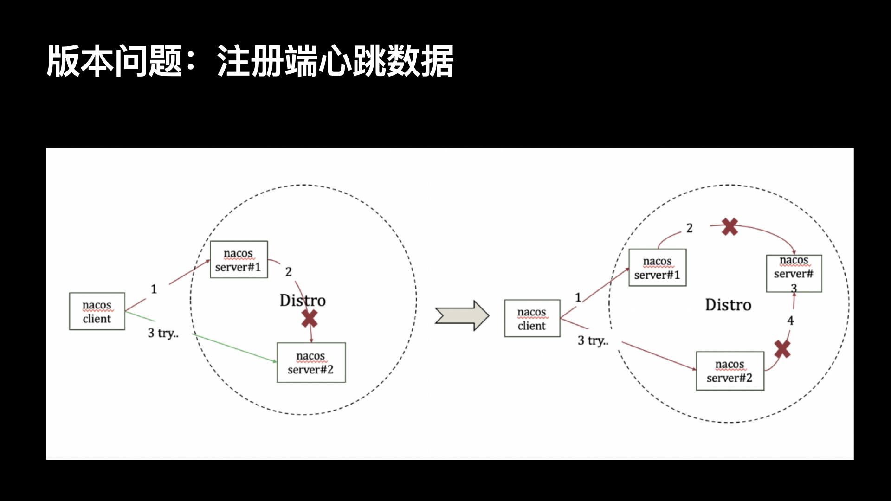

（1）客户端的版本为 1.2.1，服务端的版本为 1.1.4

（2）服务端由于 distro 协议，当判断客户端请求的服务不为自己负责时，则会转发到对应的服务端。如果集群节点（活着的）没有变化，同一个客户端请求对应的服务端不变

（3）客户端在心跳续约时，会向服务列表续约，使用轮询的方式。如果上一个失败，则下一个。每次选择的起始服务端是随机的。如果都续约失败，会有报错日志

（4）客户端的相关日志需要显式配置，否则应用不会有客户端的日志

（5）心跳信息通过 PUT 请求上报，1.1.4 的客户端会将心跳数据放置在请求参数（URL）中，而 1.2.1 的客户端将心跳信息放置在请求体（body）中

1.2.1 心跳数据放在 BODY 中，可以通过 HttpServletRequest.getParameterMap 获取

1.1.4 心跳数据放在 URL 中，可以通过 HttpServletRequest.getQueryString 获取

（6）服务端默认进行转发，开关变量 distro 可以通过开关控制，实时生效

（7）服务端在进行转发时，并不会将请求体中的心跳数据转发

### 14. 解决方案


（1）当一个服务端的挂掉的时候，无论怎么操作，都不可能再提供服务，这时候只能从客户端解决。解决方案就是使用客户端缓存，即配置：

```yml
spring.cloud.nacos.discovery.namingLoadCacheAtStart: true
```

（2）ABA 问题的实质是 Distro 协议中，服务与节点的映射关系发生了变化，导致服务端错误地将健康地实例下线（下一个心跳时就会重新注册），这种不一致的情况最长是一个心跳周期（5 秒）。这时候，我们可以模拟客户端地心跳，在 Nacos 服务端集群节点发生变化的时候，以更小地心跳周期更快地让这些服务复活，从概率上降低不一致的情况（不能完全解决）。

（3）版本问题直接升级服务端版本即可。

### 15. 实战：扩容&缩容


扩容和缩容的过程是『栈』式的，根源在于 Nacos 服务端节点之间互相发现的方式。

重点来了，每个 nacos 服务器是怎么保证 healthyList（server 列表）是一样的呢？

解决的办法仍然是心跳。

DistroMapper 初始化的时候会启动一个 ServerStatusReporter。

ServerStatusReporter 会向其他的 nacos 服务器（定时地从 cluster.conf 文件读取服务器列表）发送心跳，证明自己是健康的。

ServerStatusReporter 的 run 方法的 finally 会继续调用自己，这样就相当于是个定时任务了。

如果一直没收到其他 nacos 服务器的心跳信息呢，这里就有个神奇的逻辑了：ServerStatusReporter 是会模拟发送心跳给自己，保证 healthyList 的逻辑一定会执行。

节点会将反馈心跳的其他节点加入可用列表。

为了保持集群中各个节点观察到的可用的服务节点列表是一致的，节点的扩容和缩容需要『同时』对其他节点可见。

扩容时，先后更新集群节点的配置文件，并不会引起 Distro 协议的映射关系发生变化。因为目标节点还没启动，集群节点不会将其加入可用节点列表；而启动之后，其他节点就会一起发现。

反之，如果先启动节点，先更新配置的节点就会将其加入可用节点列表，然而其他未更新配置的节点并不会这样做（无法一瞬间将所有节点的配置一起修改），这就带来了不一致的情况：集群节点观察到的拓扑结构不一致！

缩容时，停止目标节点对其他节点同时可见（消失）。当一个心跳周期过后，就可以安全地修改配置文件了（即减少配置），因为被停止的节点已经从所有集群节点的可用列表中剔除了。

反之，如果先更新配置文件，由于无法一瞬间将所有节点的配置一起修改，这就导致了集群节点观察到的拓扑结构不一致。

### 16. 实战：日常使用

以下这些配置来自于类：NacosDiscoveryProperties

（1）客户端开启缓存

```yml
spring.cloud.nacos.discovery.namingLoadCacheAtStart: true
```

该配置参数控制启动时是否加载缓存文件，默认值为 false。也就是说，使用 nacos-client，默认是不会加载本地缓存文件的。需要手动开启加载本地缓存，才能让 Nacos 加载本地缓存文件。

该参数设置为 true 和 false 的利弊：

设置为 true，认为可用性 & 稳定性优先，宁愿接受可能出错的数据，也不能因为没有数据导致调用完全出错；

设置为 false，则认为 Server 的可用性较高，更能够接受没有数据，也不能接受错误的数据。

无论是 true 还是 false，都是对一些极端情况的兜底，而不是常态。对于注册发现场景，设置成 true，可能更合适一点，这样可以利用 Nacos 的本地缓存文件做一个兜底。

（2）客户端配置多地址，用于重试

```yml
spring.cloud.nacos.discovery.server-addr: 多个服务端的地址，用逗号隔开；或者配置一个虚 IP 或域名
```

（3）取一个好名字

```yml
spring.cloud.nacos.discovery.service: ${spring.application.name:}
```

如果没有配置 spring.application.name，则应显式指定注册的服务名。

（4）配置自定义的网络地址

```yml
spring.cloud.nacos.discovery.ip: 默认是网卡的 IP，当然也可以自己指定
spring.cloud.nacos.discovery.port: 可以自己指定
spring.cloud.nacos.discovery.networkInterface: 当有多个网卡时，应该指定网卡
```

（5）自定义元数据

```yml
spring.cloud.nacos.discovery.metadata.自定义键: 自定义的值
```

# 资料来源

1，Nacos 升级至 2.0.2 踩坑全记录
https://mp.weixin.qq.com/s/07kZQ8ljzNQx4PdUh41ZZA

2，Nacos 注册中心的设计原理详解
https://www.infoq.cn/article/B*6vyMIKao9vAKIsJYpE

3，重磅官宣：Nacos2.0 发布，性能提升 10 倍
https://mp.weixin.qq.com/s/dBVo6w0sjUORd6Axpj3zTg

4，支持 gRPC 长链接，深度解读 Nacos 2.0 架构设计及新模型
https://my.oschina.net/u/3585447/blog/4818143

5，一文详解 Nacos 高可用特性
https://developer.aliyun.com/article/780618

6，全网最详细 nacos 源码剖析
https://www.processon.com/view/5e25b762e4b04579e409e81f?fromnew=1

7，Nacos 服务注册的原理
https://www.cnblogs.com/wuzhenzhao/p/13625491.html

8，SpringCloud-Nacos 注册中心实现原理
https://blog.csdn.net/Zong_0915/article/details/113001226

9，Nacos 配置中心原理分析
https://www.cnblogs.com/wuzhenzhao/p/11385079.html

10，pringCloud-Nacos 配置中心实现原理
https://blog.csdn.net/Zong_0915/article/details/113089265

11，Apollo 配置中心设计
https://www.apolloconfig.com/#/zh/design/apollo-design
