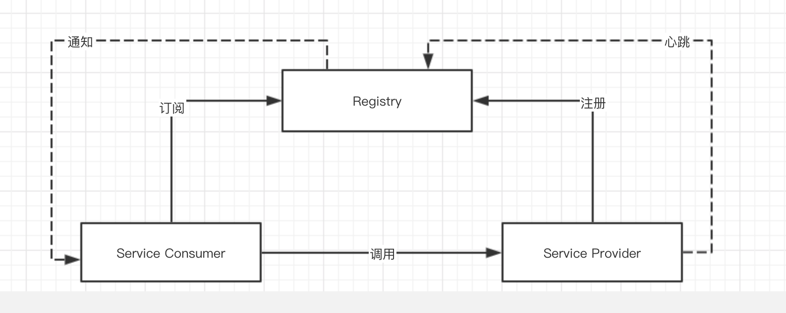
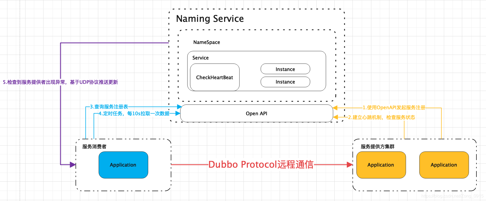
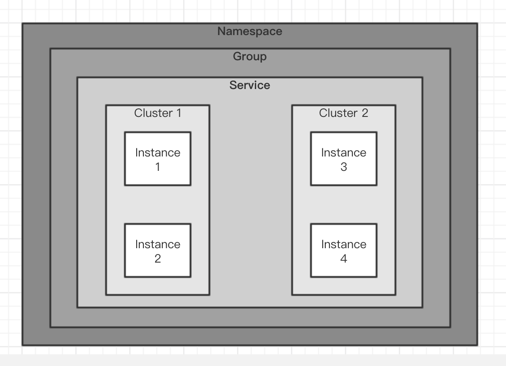
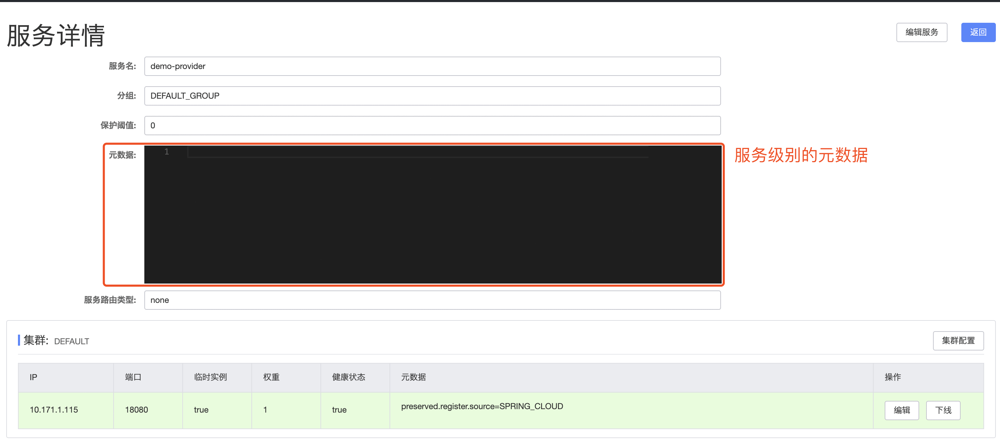
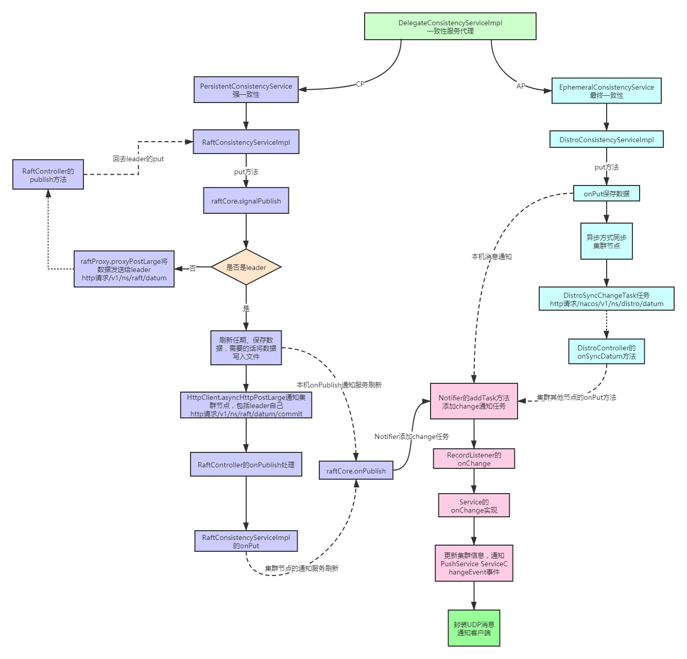
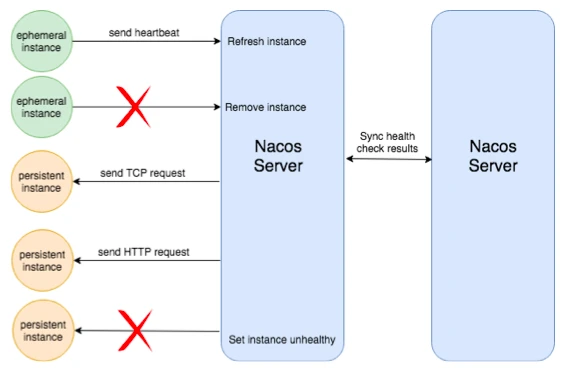
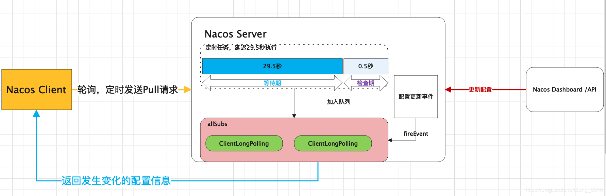

# 一，注册

### 1. 注册中心的原理

注册中心的功能体现在：

（1）服务注册：服务实例启动时注册到服务注册表，关闭时则注销

（2）服务发现：服务消费者可以通过查询服务注册表来获得可用的实例

（3）健康检查：服务注册中心需要验证服务实例是否可以正确的处理请求

在使用注册中心时，一共有三种角色：服务提供者（Service Provider）、服务消费者（Service Consumer）、注册中心（Registry）。

在一些文章中，服务提供者被称为 Server，服务消费者被称为 Client。

三个角色交互如下图所示：

#### 1.1 Provider

启动时，向 Registry 注册自己为一个服务（Service）的实例（Instance）。

同时，定期向 Registry 发送心跳，告诉自己还存活。

关闭时，向 Registry 取消注册。

#### 1.2 Consumer

启动时，向 Registry 订阅使用到的服务，并缓存服务的实例列表在内存中。

后续，Consumer 向对应服务的 Provider 发起调用时，从内存中的该服务的实例列表选择一个，进行远程调用。

关闭时，向 Registry 取消订阅。

#### 1.3 Registry

Provider 超过一定时间未心跳时，从服务的实例列表移除。

服务的实例列表发生变化（新增或者移除）时，通知订阅该服务的 Consumer，从而让 Consumer 能够刷新本地缓存。

当然，不同的注册中心可能在实现原理上会略有差异。例如说，Eureka 注册中心，并不提供通知功能，而是 Eureka Client 自己定期轮询，实现本地缓存的更新。

另外，Provider 和 Consumer 是角色上的定义，一个服务同时即可以是 Provider 也可以作为 Consumer。

### 2. 数据模型

注册中心的核心数据是服务的名字和它对应的网络地址，当服务注册了多个实例时，我们需要对不健康的实例进行过滤或者针对实例的一些特征进行流量的分配，那么就需要在实例上存储一些例如健康状态、权重等属性。

随着服务规模的扩大，渐渐的又需要在整个服务级别设定一些权限规则、以及对所有实例都生效的一些开关，于是在服务级别又会设立一些属性。

再往后，我们又发现单个服务的实例又会有划分为多个子集的需求，例如一个服务是多机房部署的，那么可能需要对每个机房的实例做不同的配置，这样又需要在服务和实例之间再设定一个数据级别

#### 2.1 Nacos 数据模型

（1）Namespace 命名空间

用于进行租户粒度的配置隔离。默认为 public（公共命名空间）。

不同的命名空间下，可以存在相同的 Group 或 Data ID 的配置。Namespace 的常用场景之一是不同环境的配置的区分隔离，例如开发测试环境和生产环境的资源（如配置、服务）隔离等。

（2）Group 服务分组

不同的服务可以归类到同一分组。默认为 DEFAULT_GROUP（默认分组）。

（3）Service 服务

例如说，用户服务、订单服务、商品服务等等。

#### 2.2 服务分级存储

（1）Instance 实例

提供一个或多个服务的具有可访问网络地址（IP:Port）的进程。

（2）Cluster 集群

同一个服务下的所有服务实例组成一个默认集群（Default）。集群可以被进一步按需求划分，划分的单位可以是虚拟集群。

例如说，我们将服务部署在多个机房之中，每个机房可以创建为一个虚拟集群。每个服务在注册到 Nacos 时，设置所在机房的虚拟集群。这样，服务在调用其它服务时，可以通过虚拟集群，优先调用本机房的服务。如此，在提升服务的可用性的同时，保证了性能。

（3）Metadata 元数据

Nacos 元数据（如配置和服务）描述信息，如服务版本、权重、容灾策略、负载均衡策略、鉴权配置、各种自定义标签 (label)。

从作用范围来看，分为服务级别的元信息、集群的元信息及实例的元信息。如下图：

### 3. 数据一致性

Nacos 通过 Raft 发布内容，内容只是存在了 Leader 节点上，通过 Raft 心跳机制来保证一致性。

在注册信息的时候，addInstance() 方法将 instance 添加到了本地缓存中，但 raft 在从 leader 到 follower 同步数据的时候，follower 接收到包之后，只是通过 onPublish() 方法进行了持久化，并没有将信息更新到本地缓存，而是通过一个监听器来实现。

#### 3.1 ephemeral

实现数据一致性监听，ephemeral 标识服务是否为临时服务，默认是持久化的，也就是 true

true 表示采用 raft 协议，

false 表示采用 Distro

在定义上区分临时实例和持久化实例的关键是健康检查的方式。

临时实例使用客户端上报模式，而持久化实例使用服务端反向探测模式。临时实例需要能够自动摘除不健康实例，而且无需持久化存储实例，那么这种实例就适用于类 Gossip 的协议。

右边的持久化实例使用服务端探测的健康检查方式，因为客户端不会上报心跳，那么自然就不能去自动摘除下线的实例。

#### 3.2 Nacos 集群选举

Nacos 集群采用 Raft 算法实现。它是一种比较简单的选举算法，用于选举出 Nacos 集群中最重要的 Leader（领导）节点。

在集群中选举出 Leader 是最重要的工作，产生选举的时机有三个：

- 在 Nacos 节点启动后，还没有产生 Leader 时选举；

- 集群成员总量变更时重新选举；

- 当 Leader 停止服务后重新选举；

#### 3.3 Nacos 节点间的数据同步过程

在 Raft 算法中，只有 Leader 才拥有数据处理与信息分发的权利。因此当微服务启动时，假如注册中心指定为 Follower 节点，则步骤如下：

第一步，Follower 会自动将注册心跳包转给 Leader 节点；

第二步，Leader 节点完成实质的注册登记工作；

第三步，完成注册后向其他 Follower 节点发起“同步注册日志”的指令；

第四步，所有可用的 Follower 在收到指令后进行“ack 应答”，通知 Leader 消息已收到；

第五步，当 Leader 接收过半数 Follower 节点的 “ack 应答”后，返回给微服务“注册成功”的响应信息。

此外，对于其他无效的 Follower 节点，Leader 仍会不断重新发送，直到所有 Follower 的状态与 Leader 保持同步。

#### 3.4 健康检查

Zookeeper 和 Eureka 都实现了一种 TTL 的机制，就是如果客户端在一定时间内没有向注册中心发送心跳，则会将这个客户端摘除。Eureka 做的更好的一点在于它允许在注册服务的时候，自定义检查自身状态的健康检查方法。这在服务实例能够保持心跳上报的场景下，是一种比较好的体验，在 Dubbo 和 SpringCloud 这两大体系内，也被培养成用户心智上的默认行为。Nacos 也支持这种 TTL 机制，不过这与 ConfigServer 在阿里巴巴内部的机制又有一些区别。Nacos 目前支持临时实例使用心跳上报方式维持活性，发送心跳的周期默认是 5 秒，Nacos 服务端会在 15 秒没收到心跳后将实例设置为不健康，在 30 秒没收到心跳时将这个临时实例摘除。

不过正如前文所说，有一些服务无法上报心跳，但是可以提供一个检测接口，由外部去探测。这样的服务也是广泛存在的，而且以我们的经验，这些服务对服务发现和负载均衡的需求同样强烈。服务端健康检查最常见的方式是 TCP 端口探测和 HTTP 接口返回码探测，这两种探测方式因为其协议的通用性可以支持绝大多数的健康检查场景。在其他一些特殊的场景中，可能还需要执行特殊的接口才能判断服务是否可用。例如部署了数据库的主备，数据库的主备可能会在某些情况下切换，需要通过服务名对外提供访问，保证当前访问的库是主库。此时的健康检查接口，可能就是一个检查数据库是否是主库的 MYSQL 命令了。

客户端健康检查和服务端健康检查有一些不同的关注点。客户端健康检查主要关注客户端上报心跳的方式、服务端摘除不健康客户端的机制。而服务端健康检查，则关注探测客户端的方式、灵敏度及设置客户端健康状态的机制。从实现复杂性来说，服务端探测肯定是要更加复杂的，因为需要服务端根据注册服务配置的健康检查方式，去执行相应的接口，判断相应的返回结果，并做好重试机制和线程池的管理。这与客户端探测，只需要等待心跳，然后刷新 TTL 是不一样的。同时服务端健康检查无法摘除不健康实例，这意味着只要注册过的服务实例，如果不调用接口主动注销，这些服务实例都需要去维持健康检查的探测任务，而客户端则可以随时摘除不健康实例，减轻服务端的压力。

Nacos 既支持客户端的健康检查，也支持服务端的健康检查，同一个服务可以切换健康检查模式。

# 二，配置

### 1. Nacos 配置更新原理

Nacos 服务端创建了相关的配置项后，客户端就可以进行监听了。客户端是通过一个定时任务来检查自己监听的配置项的数据的，一旦服务端的数据发生变化时，客户端将会获取到最新的数据，并将最新的数据保存在一个 CacheData 对象中，然后会重新计算 CacheData 的 md5 属性的值，此时就会对该 CacheData 所绑定的 Listener 触发 receiveConfigInfo 回调。

考虑到服务端故障的问题，客户端将最新数据获取后会保存在本地的 snapshot 文件中，以后会优先从文件中获取配置信息的值。

#### 1.1 客户端如何感知到数据发生变化

Nacos 的客户端维护了一个长轮询的任务，去检查服务端的配置信息是否发生变更，如果发生了变更，那么客户端会拿到变更的 groupKey 再根据 groupKey 去获取配置项的最新值即可。

每次都靠客户端去发请求，询问服务端我所关注的配置项有没有发生变更，那请求的间隔改设置为多少才合适呢？

如果间隔时间设置的太长的话有可能无法及时获取服务端的变更，如果间隔时间设置的太短的话，那么频繁的请求对于服务端来说无疑也是一种负担。

所以最好的方式是客户端每隔一段长度适中的时间去服务端请求，而在这期间如果配置发生变更，服务端能够主动将变更后的结果推送给客户端，这样既能保证客户端能够实时感知到配置的变化，也降低了服务端的压力。

#### 1.2 长轮训的概念

客户端发起一个请求到服务端，服务端收到客户端的请求后，并不会立刻响应给客户端，而是先把这个请求 hold 住，然后服务端会在 hold 住的这段时间检查数据是否有更新，如果有，则响应给客户端，如果一直没有数据变更，则达到一定的时间（长轮训时间间隔）才返回。

长轮训典型的场景有：扫码登录、扫码支付。

### 2. nacos 是采用推还是拉

实时感知是建立在客户端拉和服务端“推”的基础上，但是这里的服务端“推”需要打上引号，因为服务端和客户端直接本质上还是通过 http 进行数据通讯的，之所以有“推”的感觉，是因为服务端主动将变更后的数据通过 http 的 response 对象提前写入了

### 3. 客户端长轮询的响应时间会受什么影响

客户端长轮询的响应时间，设置的是 30s，但是有时响应很快，有时响应很慢，这取决于服务端的配置有没有发生变化。当配置发生变化时，响应很快就会返回，当配置一直没有发生变化时，会等到 29.5s 之后再进行响应。

#### 3.1 为什么更改了配置信息后客户端会立即得到响应

因为服务端会在更改了配置信息后，找到具体的客户端请求中的 response，然后直接将结果写入 response 中，就像服务端对客户端进行的数据 “推送” 一样，所以客户端会很快得到响应。

#### 3.2 客户端的超时时间为什么要设置为 30s

这应该是一个经验值，该超时时间关系到服务端调度任务的等待时间，服务端在前 29.5s 只需要进行等待，最后的 0.5s 才进行配置变更检查。

如果设置的太短，那服务端等待的时间就太短，如果这时配置变更的比较频繁，那很可能无法在等待期对客户端做推送，而是滑动到检查期对数据进行检查后才能将数据变更发回给客户端，检查期相比等待期需要进行数据的检查，涉及到 IO 操作，而 IO 操作是比较昂贵的，我们应该尽量在等待期就将数据变更发送给客户端。

http 请求本来就是无状态的，所以没必要也不能将超时时间设置的太长，这样是对资源的一种浪费。

# 三，资料

### 1. Nacos 注册中心的设计原理详解

https://www.infoq.cn/article/B*6vyMIKao9vAKIsJYpE

### 2. 重磅官宣：Nacos2.0 发布，性能提升 10 倍

https://mp.weixin.qq.com/s/dBVo6w0sjUORd6Axpj3zTg

### 3. 支持 gRPC 长链接，深度解读 Nacos 2.0 架构设计及新模型

https://my.oschina.net/u/3585447/blog/4818143

### 4. Nacos 配置中心原理分析

https://www.cnblogs.com/wuzhenzhao/p/11385079.html

### 5. Nacos 服务注册的原理

https://www.cnblogs.com/wuzhenzhao/p/13625491.html

### 6. SpringCloud-Nacos 注册中心实现原理

https://blog.csdn.net/Zong_0915/article/details/113001226

### 7. SpringCloud-Nacos 配置中心实现原理

https://blog.csdn.net/Zong_0915/article/details/113089265

### 8. nacos 系列

https://segmentfault.com/a/1190000038835575?utm_source=sf-similar-article
https://www.iocoder.cn/Nacos/good-collection/

### 9. 全网最详细 nacos 源码剖析-出自图灵学院微服务源码课 Nacos 源码剖析-服务注册与发现(临时实例 AP 模式)

https://www.processon.com/view/5e25b762e4b04579e409e81f?fromnew=1
https://www.processon.com/view/5e5fa095e4b03ecc75201629?fromnew=1
https://www.processon.com/view/5e60a8f5e4b03ecc7521bc59?fromnew=1

### 10. 一文详解 Nacos 高可用特性

https://developer.aliyun.com/article/780618
