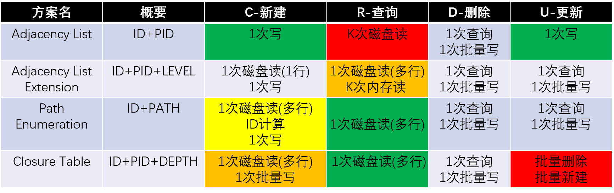

### 树形结构
问题：如何在在关系数据库中存储一棵树？

### 范式
第一范式（1NF）

“要有键”，即要求数据库表的每一列都是不可分割的原子数据项。

第二范式（2NF）

“要有主键”，即需要确保数据库表中的每一列都和主键相关，而不能只与主键的某一部分相关（主要针对联合主键而言）

第三范式（3NF）

“无传递依赖”，即需要确保数据表中的每一列数据都和主键直接相关，而不能间接相关。

巴斯-科德范式（BCNF）

“3.5范式”，即主属性不依赖于主属性。

第四范式(4NF）

“无多值依赖”，即要求把同一表内的多对多关系删除。

第五范式（5NF）

“完美范式”，即从最终结构重新建立原始结构。

### 方案
方案一：Adjacency List

传统方案，通过存储上级 ID 来体现树形结构，类似于单链表。

查询上下级关系非常容易，但是查询多级关系，比如查询某节点的所有祖先或所有子孙则比较难。因为数据存储时，与之关联的层级信息只有父节点ID，意味着关联的层级为1，跨层级查询需要多次操作。

可喜的是，插入或删除非常简单。

方案二：Path Enumeration

如果某个字段保存了该节点到根节点之间的所有节点路径，那岂不是关联的层级可以扩展到树的深度？跨层级访问只需要前缀匹配即可。

这里使用 PATH 存储路径信息。祖先信息都存储在路径中，而子孙信息通过模糊可以获得。

对于上下层级的区分，这里有两种方案：一种是使用特殊的分隔符。比如 "/" 来区分层级。例如： /a/b/c 表示根节点的 PATH 为 a，中间节点的 PATH 为 b，而该节点的 PATH 为 c。注意到其实 PATH 的长度没有限制，但是一定不能出现分隔符，以免混淆。另一种是使用固定长度。比如设置层级的长度为3。例如： 000001002 表示根节点的 PATH 为 000，中间节点的 PATH 为 001，而该节点的 PATH 为 002。

方案三：Closure Table

如果保存该节点到所有祖先节点的关联信息，那岂不是关联的层级已经全部覆盖？一次查询就足够。

这里使用 PID 存储祖先节点ID，同时需要维护该节点到 PID 的路径深度 DEPTH，用来区分层级。这种方式相当于将树形结构扁平化（其实就是关系的闭包：如果a->b，b->c，则有a->c），通过数据的冗余来减少查询的次数。

因为数据有大量冗余，可以只冗余上下级关系，对于节点数据，可以使用另一张表单独存储。

### 分析&总结

CURD定义如下：

查询：查找祖先与查找子孙；K表示树的深度或层数

删除：指删除子树，包括其下所有子孙

更新：指的是子树的移动，即子树的根节点换一个父节点

我们对比方案在不同操作上的磁盘IO消耗（数据库的主要开销在磁盘IO），来评估方案的优劣。这里使用不同颜色标识操作的时间消耗：颜色从绿色，黄色，橙色一直到红色，时间消耗越来越多。

方案一：Adjacency List

优点：只存储上级 ID，存储数据少，结构类似于单链表，在查询相邻节点的时候很方便。添加删除节点都比较简单。

缺点：查询多级结构的时候会显得力不从心。

适用场合：对多级查询需求不大的场景比较适用。

PS：Adjacency List Extension 方案

优点：针对查询多级结构需要多次磁盘IO的问题，这里将相关数据载入内存。维护层级字段 LEVEL 用于过滤数据，减少内存占用。

缺点：对内存的消耗比较大，高并发时容易OOM。

使用场合：表中数据量较小的场景。

方案二：Path Enumeration

优点：查询多级结构的时候比较方便。查询相邻节点时也比较OK。增加或者删除节点的时候比较简单。

缺点：需要存储的 PATH 值可能会很大，甚至超过设置的最大值范围，理论上无法无限扩张。

适用场合：结构相对简单的场景比较适合。

方案三：Closure Table

优点：在查询树形结构的任意关系时都很方便。

缺点：需要存储的数据量比较多，索引表需要的空间比较大，增加和删除节点相对麻烦。

适用场合：纵向结构不是很深，增删操作不频繁的场景比较适用。

### 资料来源
1. 【MySQL疑难杂症】如何将树形结构存储在数据库中（方案一 Adjacency List）
https://www.cnblogs.com/mfrank/p/7992709.html

2. 【MySQL疑难杂症】如何将树形结构存储在数据库中（方案二 Path Enumeration）
https://www.cnblogs.com/mfrank/p/8010973.html

3. 【MySQL疑难杂症】如何将树形结构存储在数据库中（方案三 Closure Table）
https://www.cnblogs.com/mfrank/p/8016345.html

4. 在数据库中存储一棵树，实现无限级分类
https://segmentfault.com/a/1190000014284076
