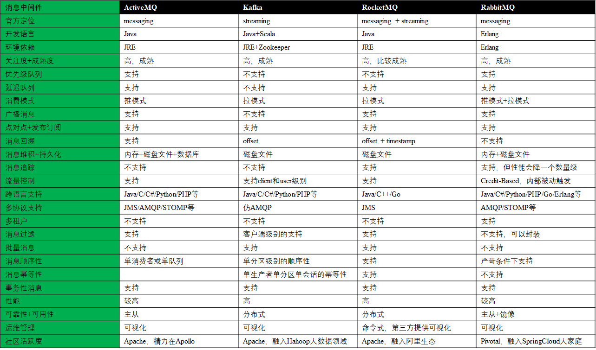

### 开源消息中间件的F4对比

### 简评
ActiveMQ 地位尴尬，由于历史原因包袱太重，市场占用率比不上其他三个MQ，就等 Apollo 出来了。

RabbitMQ 在于 routing，而 Kafka 在于 streaming。

RabbitMQ 与 RocketMQ 王不见王！！

RocketMQ 是分布式的，可以动态扩展，支持高并发。主要特点是消息的顺序性和幂等性。

RabbitMQ 的可靠性、灵活的路由、集群、事务、高可用的队列、消息排序、问题追踪、可视化管理工具、插件系统等，在金融支付领域大量使用。

### 选型建议
（0）可选 ActiveMQ 的理由：队列个数低于1K

（1）流式处理；大数据；性能高于可靠性等；Kafka

（2）高并发；分布式；次序消息与回溯等；RocketMQ

（3）金融支付；可靠性与可用性；优先级与延迟队列等；RabbitMQ

### 资料来源
#### 1. ActiveMQ 官网
http://activemq.apache.org/

#### 2. Kafka 官网
http://kafka.apache.org/

#### 3. RocketMQ 官网
http://rocketmq.apache.org/docs/motivation/

#### 4. RabbitMQ 官网
https://www.rabbitmq.com/

#### 5. 消息中间件选型分析
https://mp.weixin.qq.com/s/ad7jibTb5nTzh3nDQYKFeg
