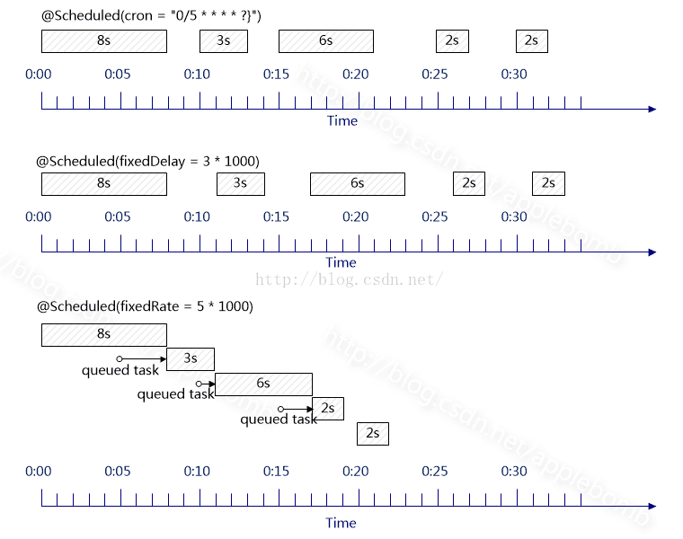

## 定时任务

&#8195;&#8195;在 Java 世界里，JDK 原先提供 Timer 类来做定时任务，但是 Timer 有缺陷。JDK1.5 之后，java.util.concurrent 包里提供 ScheduledThreadPoolExecutor 类来代替 Timer 做定时任务。

&#8195;&#8195;ScheduledThreadPoolExecutor 提供的定时任务方法有：

（1）scheduleAtFixedRate，固定频率

（2）scheduleWithFixedDelay，固定时延

&#8195;&#8195;而在 SpringBoot 中，提供3种定时任务：

（1）cron，Spring 融合 quartz 框架，类似 crontab 命令

（2）fixedRate，固定频率，类似 scheduleAtFixedRate

（3）fixedDelay，固定时延，类似 scheduleWithFixedDelay

&#8195;&#8195;实际上，这3种定时任务的底层实现都是 JDK 的 ScheduledThreadPoolExecutor，只不过有各自不同的排队策略与拒绝策略（ScheduledThreadPoolExecutor 继承自 ThreadPoolExecutor，所以本质上说 ScheduledThreadPoolExecutor 还是一个线程池，也有 coorPoolSize 和 workQueue，接受 Runnable 的子类作为任务被多线程调用，特殊的地方在于，自己实现了工作队列）。

&#8195;&#8195;那怎么实现周期性呢？

&#8195;&#8195;每次执行完任务后不返回，而是计算出下次执行的时间，重新将任务放到工作队列中，等待下次调用。


### 一 准备工作
&#8195;&#8195;这里简单了解下 cron 表达式，还有 Spring 定时任务的区别。

#### 1.1 cron 表达式
&#8195;&#8195;cron一共有7位，但是最后一位是年，可以留空，所以我们可以写6位，有两种形式：
```
Seconds Minutes Hours DayofMonth Month DayofWeek Year
或
Seconds Minutes Hours DayofMonth Month DayofWeek
```
* 第一位，表示秒，取值0-59
* 第二位，表示分，取值0-59
* 第三位，表示小时，取值0-23
* 第四位，日期天/日，取值1-31
* 第五位，日期月份，取值1-12
* 第六位，星期，取值1-7，星期一，星期二...，注：不是第1周，第二周的意思。另外：1表示星期天，2表示星期一。
* 第7为，年份，可以留空，取值1970-2099

&#8195;&#8195;cron中，还有一些特殊的符号，含义如下：
```
(*)星号：可以理解为每的意思，每秒，每分，每天，每月，每年...
(?)问号：问号只能出现在日期和星期这两个位置，表示这个位置的值不确定，每天3点执行，所以第六位星期的位置，我们是不需要关注的，就是不确定的值。同时：日期和星期是两个相互排斥的元素，通过问号来表明不指定值。比如，1月10日，比如是星期1，如果在星期的位置是另指定星期二，就前后冲突矛盾了。
(-)减号：表达一个范围，如在小时字段中使用“10-12”，则表示从10到12点，即10,11,12
(,)逗号：表达一个列表值，如在星期字段中使用“1,2,4”，则表示星期一，星期二，星期四
(/)斜杠：如：x/y，x是开始值，y是步长，比如在第一位（秒） 0/15就是，从0秒开始，每15秒，最后就是0，15，30，45，60    另：*/y，等同于0/y
```

&#8195;&#8195;下面列举几个例子：
```
0 0 3 * * ?     每天3点执行
0 15 3 * * ?    每天3点15分执行
0 5 3 ? * *     每天3点5分执行，与上面作用相同
0 5/10 3 * * ?  每天3点的 5分，15分，25分，35分，45分，55分这几个时间点执行
0 10 3 ? * 1    每周星期天，3点10分 执行，注：1表示星期天
0 10 3 ? * 1#3  每个月的第三个星期，星期天 执行，#号只能出现在星期的位置
```

#### 1.2 Spring 定时任务的区别
&#8195;&#8195;图片来源：http://blog.csdn.net/applebomb/article/details/52400154



* @Scheduled(cron = "0/5 * * * * ?")，在每分钟的0秒、5秒、10秒、15秒、20秒、25秒、30秒、35秒、40秒、45秒、50秒、55秒的时刻执行一次任务。这里由于0:00秒开始的任务耗时过长，超过下次执行任务的时间点（0:05秒），则0:05秒开始的任务直接取消。同理，0:20秒开始的任务也被取消了。

* @Scheduled(fixedDelay = 3*1000)，从当前时间开始，在上一次任务完成后3秒，再执行下一次任务。这里任务之间的间隔时间就是3秒。

* @Scheduled(fixedRate = 5*1000)，从当前时间开始（假设为0:00秒），每隔5秒执行一次任务。这里由于0:00秒开始的任务耗时过长，超过下次执行任务的时间点（0:05秒），0:05秒的任务进入等待队列，待0:00秒的任务执行完后（0:08秒），0:05秒的任务立即执行。同理，0:10秒的任务在0:11秒处立即执行。

### 二 代码示例及说明

#### 2.1 @Scheduled注解

&#8195;&#8195;执行定时任务时，在定时任务方法上增加 @Scheduled 注解。

&#8195;&#8195;示例中演示了三种方式。其中 initialDelay 指的是定时任务开始执行的时机。如果不设置，则启动时就开始执行任务。

>initialDelay = 10000L，意思是在应用启动10秒之后才开始执行任务。

&#8195;&#8195;建议：在定时任务的方法中，最好使用 try-catch 处理可能的异常。
```java
import org.springframework.scheduling.annotation.Scheduled;
import org.springframework.stereotype.Component;

@Component
public class ScheduledTask {

    @Scheduled(cron = "0 15 3 * * ?")
    public void TestCronTask() {

        // 每天3点15分执行任务
    }

    @Scheduled(initialDelay = 10000L, fixedRate = 60000L)
    public void TestFixedRateTask() {

        // 10秒之后开始执行任务，之后，每隔60秒执行一次任务
    }

    @Scheduled(initialDelay = 10000L, fixedDelay = 60000L)
    public void TestFixedDelayTask() {

        // 10秒之后开始执行任务，之后，在上一次任务执行完后60秒，再执行下一次任务
    }

}

```

#### 2.2 @EnableScheduling 注解

&#8195;&#8195;在启动类上增加 @EnableScheduling 注解。只有这样，SpringBoot 才会启动 @Scheduled 注解的任务。

```java
import org.springframework.boot.SpringApplication;
import org.springframework.boot.autoconfigure.SpringBootApplication;
import org.springframework.scheduling.annotation.EnableScheduling;

@SpringBootApplication
@EnableScheduling
public class App {

    public static void main(String[] args) {

        SpringApplication.run(App.class, args);

    }
}

```


#### 2.3 定时任务线程池设置

&#8195;&#8195;SpringBoot 基本原则是 约定（默认）大于配置。在定时任务这一块，默认的执行线程个数为1。所以，在一个应用中，如果有多个定时任务，请将执行线程个数调大一点，建议设置为：任务数+1，否则可能出现意料之外的情况（并发问题）。

&#8195;&#8195;注意：配置类上使用 @Configuration 注解。
```java
import org.slf4j.Logger;
import org.slf4j.LoggerFactory;
import org.springframework.context.annotation.Bean;
import org.springframework.context.annotation.Configuration;
import org.springframework.scheduling.TaskScheduler;
import org.springframework.scheduling.annotation.SchedulingConfigurer;
import org.springframework.scheduling.concurrent.ThreadPoolTaskScheduler;
import org.springframework.scheduling.config.ScheduledTaskRegistrar;

@Configuration
public class MySchedulingConfigurer implements SchedulingConfigurer {

    private static final Logger LOGGER = LoggerFactory.getLogger(MySchedulingConfigurer.class);

    //这里将定时任务线程池大小设为：处理器个数*2
    private static final int POOLSIZE = Runtime.getRuntime().availableProcessors() * 2;

    @Override
    public void configureTasks(ScheduledTaskRegistrar taskRegistrar) {

        TaskScheduler taskScheduler = MytaskScheduler();
        taskRegistrar.setTaskScheduler(taskScheduler);
        LOGGER.info("SET ThreadPoolTaskScheduler POOL AS " + POOLSIZE);
    }

    /**
     * 并行任务使用策略：多线程处理
     *
     * @return ThreadPoolTaskScheduler 线程池
     */
    @Bean(destroyMethod = "shutdown")
    public ThreadPoolTaskScheduler MytaskScheduler() {

        ThreadPoolTaskScheduler scheduler = new ThreadPoolTaskScheduler();
        scheduler.setPoolSize(POOLSIZE);
        scheduler.setThreadNamePrefix("Scheduling-");
        scheduler.setAwaitTerminationSeconds(60);
        scheduler.setWaitForTasksToCompleteOnShutdown(true);
        scheduler.initialize();
        return scheduler;
    }

}
```

### 三 参考资料

#### 3.1 Timer 的缺陷
http://blog.csdn.net/lmj623565791/article/details/27109467

#### 3.2 深度解析ScheduledThreadPoolExecutor
http://ju.outofmemory.cn/entry/99456

#### 3.3 Java 线程池的异常处理机制
https://my.oschina.net/lifany/blog/884002

#### 3.4 Spring Boot中使用@Scheduled创建定时任务
http://blog.didispace.com/springbootscheduled/

#### 3.5 Java 定时任务实现原理详解
https://blog.csdn.net/u013332124/article/details/79603943
